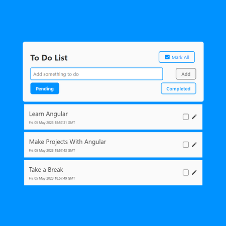
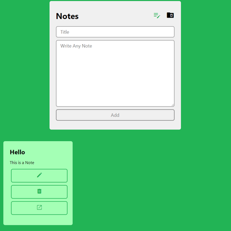
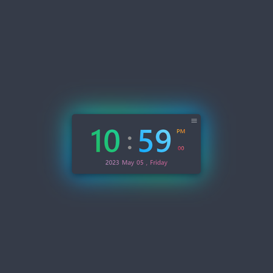
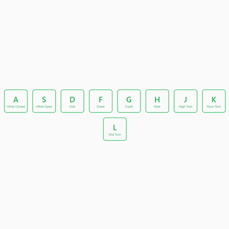

# Angular Sample Projects

This Project is a Collection of a Sample Projects Made By Arsen During Learning Angular. (There Are Also Some Projects After Learning Angular)

## Table of Contents:
- [All Basic Projects](#all-basic-projects)
- [Gallery](#gallery)
- [Install and Other Commands](#install)

## All Basic Projects

#### Basic Projects Included in The List:
- Notes App
- To Do List
- Weather App
- Toast Notification
- Rock Paper Scissors
- Quote Generator
- Piano
- Drawing App
- Filter Cards with CSS Classes
- Magic 8 Ball Game
- Drum Kit
- Color Generator
- Clock
- Calculator
- Theme Switcher (Dark Mode, Light Mode)
- Chat Application
- Mention Autocomplete Input Box
- Location Finder

#### Basic Projects Included Both in the List and in a Separate Repository
- [Weather App](https://github.com/ArsenGabrielyan/weather-app)
- [Notes App](https://github.com/ArsenGabrielyan/notes-app)
- [To Do List](https://github.com/ArsenGabrielyan/to-do-list)

#### Basic Projects Included in a Separate Repository Only
- [To Do List with a State Management (NGXS) and Local Storage](https://github.com/ArsenGabrielyan/ng-to-do-with-state-mgmt)
- [Forum Site (With an Upvotes and Downvotes)](https://github.com/ArsenGabrielyan/ng-forum-site)
- [eCommerce Site](https://github.com/ArsenGabrielyan/eshop-project)

## Gallery
<p align="left">




</p>

## Install:
```bash
git clone https://github.com/ArsenGabrielyan/ng-sample-projects.git
cd ng-sample-projects
npm install
npm install -g @angular/cli
npm start
```
## Other Commands
`npm run build` - Builds an Application <br>
`npm start` - Starts the Application to `http://localhost:4200/`

> GitHub [@ArsenGabrielyan](https://github.com/ArsenGabrielyan) &nbsp;&middot;&nbsp;
> [Arsen's Website](https://arsen-g.web.app)